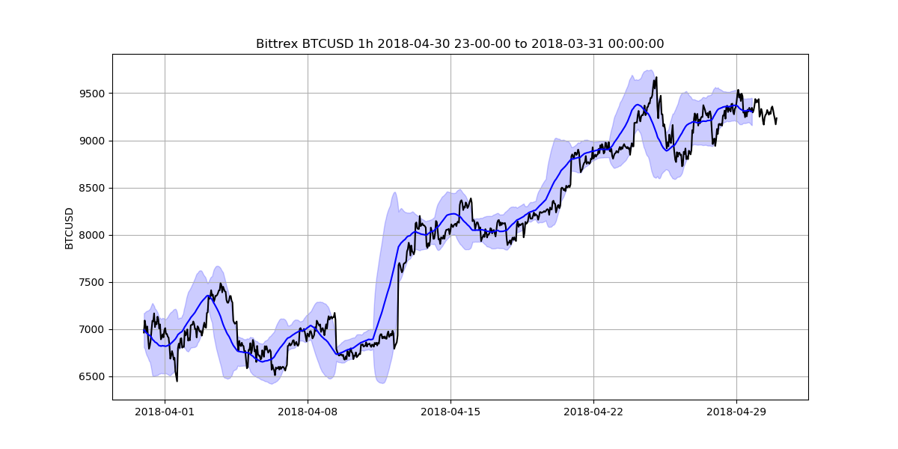

# plot-cryptos
Plotting metrics for crypto data


## Sample Output



## The Code
### The Meat
```Python
# Iterate through all of the data files found use index to match name of input file
for i, df in enumerate(l_dfs,0):
    # Process Raw Data
    df = fix_bittrex_dates(df)

    # Assign parameters
    price = df['Close']    # Choose which price data to plot
    metric_time_delta = 30    # Choose the time averaged for Mean Average and Mean Standard Deviation
    start_date_1 = '1/1/2018'    # Choose first start date time
    start_date_2 = '2/1/2018'    # Choose second start date time
    num_periods = 3    # Choose number of intervals to plot
    time_freq = 'M'    # Choose time-series range of each individual plot
    date_format ='%Y-%m-%d'    # Choose how the dates are formatted
    
    # Process the assigned parameters 
    dates = zip_dates(start_date_1, start_date_2, num_periods, time_freq, date_format)
    # Calculate the mean and standard deviation
    ma = price.rolling(metric_time_delta).mean()
    mstd = price.rolling(metric_time_delta).std()

    # plot each set of dates
    for day1, day2 in dates:
        thisdf = df.loc[day1:day2, :]
        crypto_plot(thisdf, requiredfiles[i])

```

### Functions

```Python
def read_bittrex(crypto_path):
    df_crypto = pd.read_csv(crypto_path, low_memory=False, header=1)
    print(df_crypto.head())
    return df_crypto

def fix_bittrex_dates(df_crypto):
    #set an index by dates
    df_crypto['Date'] = pd.to_datetime(df_crypto['Date'], format="%Y-%m-%d %I-%p", errors='coerce')
    df_crypto.index = df_crypto['Date']
    return df_crypto

def zip_dates(start_date_1, start_date_2, num_periods, time_freq, date_format):
    dates = zip(pd.date_range(start=start_date_1, periods=num_periods, freq=time_freq).format(formatter=lambda x: x.strftime(date_format)),pd.date_range(start=start_date_2, periods=num_periods, freq=time_freq).format(formatter=lambda x: x.strftime(date_format)))
    return dates

def crypto_plot(thisdf, crypto_market):
    # thisdf.index = thisdf['Date']
    price = thisdf['Close']
    ma = price.rolling(20).mean()
    mstd = price.rolling(20).std()

    plt.figure(2,figsize=(12,6))
    fill_plt = plt.fill_between(mstd.index, ma-2*mstd, ma+2*mstd, color='b', alpha=0.2)
    plt.plot(price.index, price, 'k', ma.index, ma, 'b')
    plt.savefig(''.join(('output/',crypto_market.replace('.csv',''),' ',str(pd.to_datetime(thisdf.Date.values[0])).replace(':','-'), ' to ',str(pd.to_datetime(thisdf.Date.values[-1])),'.png')).replace(':','-').replace(' ','_'))
    plt.show()
```


